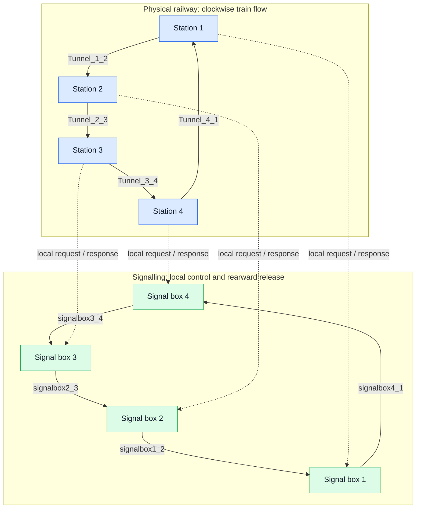

TerminalLine: a verified circular railway model
================================================

## 1. What this project is

TerminalLine is a small railway safety model written in Promela for the SPIN
model checker.

### System at a glance

The top layer is the physical railway and clockwise train flow.  The lower
layer is the signalling network: each signal box controls its local station
and sends tunnel-release notifications to the box behind it.

The railway has:

- four stations, numbered 1 to 4;
- four one-way tunnels forming a circle;
- trains that always move clockwise;
- one signal box controlling each station's departure signal.

The model starts with two trains: one at station 2 and one at station 4.
Stations can hold trains.  The safety rule concerns tunnels: at most one train
may be inside any tunnel at any time.

In the Promela model, a tunnel is a buffered channel.  A `TRAIN` message means
that a train is inside that tunnel.  Tunnel capacity is deliberately two.  If
the capacity were one, the channel itself would prevent SPIN from reaching the
collision state that we want to detect.

The model is in [Source/TerminalLine.pml](Source/TerminalLine.pml).

## 2. How the railway works

Each station observes only two physical events:

1. Receiving `TRAIN` from its rear tunnel means that a train has arrived.
2. Sending `TRAIN` to its forward tunnel means that a train has departed.

When a station has a train but its signal is red, it sends `REQUEST` to its
local signal box.  The box replies with either:

- `PROCEED`, if the forward tunnel is free; or
- `DO_NOT_PROCEED`, if the forward tunnel is occupied.

When a train departs, the station sends `DEPARTURE` to its signal box.  When a
train arrives, it sends `ARRIVAL`.  The signal boxes pass a
`TUNNEL_IS_EMPTY` notification backwards around the circle so that the box
controlling the rear of that tunnel can release its reservation.

Local station/box links are rendezvous channels.  Signal-box links are
two-place buffered channels so that an arrival notification does not create an
unintended circular communication blockage.  The model has no `atomic`,
`d_step`, or `timeout` statements.

## 3. Improvements over the original design

The current version keeps the original railway idea but makes its model and
verification more reliable.

### Safety and monitoring

- The original one-shot assertion was replaced by a continuous monitor that
  asserts only when the unsafe condition is reached.
- The monitor does not remain continuously enabled in safe states, so it does
  not hide deadlocks.
- Safety is checked both by the monitor assertion and by LTL claim `p1`.

### Correct properties

- `p1` is the direct safety property: every tunnel always contains fewer than
  two trains.
- `p2` is a directly observable progress property: eventually some train
  enters a tunnel.
- `p4` records requests explicitly and checks that every pending request is
  eventually answered, under weak process fairness.
- The old idea of comparing transient channel contents for a liveness claim
  was removed.  Channels are communication mechanisms, not stable request
  history variables.

### Communication and initialization

- Inter-box channels are buffered with capacity two.  This matches the
  two-train model and prevents notification traffic from forming an accidental
  rendezvous deadlock.
- The forbidden `atomic` initialization block was removed.  SPIN now explores
  process creation as ordinary interleaved behavior.
- Channel direction and the meaning of every message are documented directly
  in the model.

### Optional verification expansion

Compile with `EXPANDED_VERIFY` to enable additional verification-only state and
assertions:

- `block_reserved[4]` records the reservation associated with an authorized
  departure;
- station occupancy is checked against the two-train bound;
- duplicate pending requests are rejected;
- invalid station/box message types are rejected;
- departure and release events are checked for valid reservation order;
- LTL claim `p3` checks that every occupied tunnel has a corresponding rear
  signal-box reservation.

This instrumentation does not choose protocol actions.  It is intentionally
optional because shared observation variables make the state space much larger
and reduce the benefit of partial-order reduction.

## 4. Get the project from GitHub and run it on an Apple Silicon Mac

These steps work on an Apple Silicon Mac such as an M1, M2, M3, or M4.
For this project, macOS and Linux are the recommended platforms.  Windows is
supported, but WSL2 is the easiest Windows setup.

### One-time setup

1. Install Git.  If macOS asks for the Xcode Command Line Tools, choose
   **Install**.  You can also start that installer from Terminal with
   `xcode-select --install`.
2. Install [Homebrew](https://brew.sh) if it is not already installed.
3. Open **Terminal** and install SPIN:

       brew install spin

### Download the project

In Terminal, run:

    cd ~/Documents
    git clone https://github.com/nlintas/Verified-Safety-Railway-Promela-Spin-Model.git
    cd Verified-Safety-Railway-Promela-Spin-Model

The repository contains the model at `Source/TerminalLine.pml` and the
clickable verifier at `verify_on_macos.command`.

### Verify with one click

Make the script executable once:

    chmod +x verify_on_macos.command

Then either double-click `verify_on_macos.command` in Finder or run:

    open verify_on_macos.command

macOS opens a Terminal window and runs the short verification suite.  It checks
normal safety, deadlock/assertion behavior, initial movement, fair request
response, and bounded reservation consistency.  The window reports `ALL CHECKS
PASSED` when every check returns successfully.

The script automatically searches Apple Silicon Homebrew's usual location
`/opt/homebrew/bin`, so it also works when Finder does not load your normal
shell `PATH`.  It removes temporary SPIN compiler files when it finishes.

If macOS blocks a script downloaded as a ZIP file, right-click it, choose
**Open**, and confirm.  A project cloned with Git normally avoids that warning.

### Linux: manual commands (recommended)

Linux is the other recommended platform because SPIN and the generated C
verifier fit naturally into the standard command-line toolchain.

The following commands are for Ubuntu or Debian:

1. Install Git, SPIN, and a C compiler:

       sudo apt update
       sudo apt install git spin build-essential

2. Download the project:

       cd ~/Documents
       git clone https://github.com/nlintas/Verified-Safety-Railway-Promela-Spin-Model.git
       cd Verified-Safety-Railway-Promela-Spin-Model

3. Confirm that SPIN is available:

       spin -V

4. Run the normal safety check:

       spin -search -safety -bfs -ltl p1 Source/TerminalLine.pml

5. Run the deadlock and assertion check:

       spin -search -noclaim -m2000000 Source/TerminalLine.pml

6. Run the initial movement property:

       spin -search -ltl p2 Source/TerminalLine.pml

7. Run the fair request-response regression:

       spin -search -ltl p4 -f -DNOREDUCE -DBITSTATE -DNFAIR=4 -w20 -m20000 Source/TerminalLine.pml

8. Run the bounded reservation-consistency check:

       spin -DEXPANDED_VERIFY -search -safety -bfs -ltl p3 -m80 Source/TerminalLine.pml

Other Linux distributions can use their own package manager to install `git`,
`spin`, and a C compiler such as `gcc`.  The verification commands after step 3
are the same.

### Windows: manual commands through WSL2 (recommended Windows method)

Windows can run this project.  The simplest Windows setup is WSL2, which gives
you an Ubuntu terminal inside Windows.  This is recommended over native
PowerShell because the model's commands and SPIN's generated C verifier use a
Unix-like shell and compiler.  See Microsoft's [WSL installation guide](https://learn.microsoft.com/en-us/windows/wsl/install).

1. Open **PowerShell as Administrator**.
2. Install WSL and Ubuntu:

       wsl --install

3. Restart Windows if requested, then open **Ubuntu** from the Start menu.
4. Inside Ubuntu, install the required tools:

       sudo apt update
       sudo apt install git spin build-essential

5. Download the project inside Ubuntu:

       cd ~
       git clone https://github.com/nlintas/Verified-Safety-Railway-Promela-Spin-Model.git
       cd Verified-Safety-Railway-Promela-Spin-Model

6. Confirm SPIN:

       spin -V

7. Run the checks manually, in this order:

       spin -search -safety -bfs -ltl p1 Source/TerminalLine.pml
       spin -search -noclaim -m2000000 Source/TerminalLine.pml
       spin -search -ltl p2 Source/TerminalLine.pml
       spin -search -ltl p4 -f -DNOREDUCE -DBITSTATE -DNFAIR=4 -w20 -m20000 Source/TerminalLine.pml
       spin -DEXPANDED_VERIFY -search -safety -bfs -ltl p3 -m80 Source/TerminalLine.pml

Native Windows execution is also possible with the official Windows SPIN
executable and a Unix-like build environment such as Cygwin or MSYS2 with a C
compiler.  The official [SPIN installation documentation](https://spinroot.com/spin/Man/README.html)
describes Windows executables and Cygwin workflows.  Native setup is more
variable, so WSL2 is the recommended Windows route for this repository.

## 5. Running the checks manually

Install SPIN on macOS, for example:

    brew install spin
    spin -V

Run the exhaustive safety check:

    spin -search -safety -bfs -ltl p1 Source/TerminalLine.pml

Run the full DFS deadlock/assertion check:

    spin -search -noclaim -m2000000 Source/TerminalLine.pml

The increased DFS depth is intentional.  SPIN warns that BFS does not preserve
all invalid end states when rendezvous channels are present.

Run the initial movement property:

    spin -search -ltl p2 Source/TerminalLine.pml

Run a quick request/response fairness regression:

    spin -search -ltl p4 -f -DNOREDUCE -DBITSTATE -DNFAIR=4 -w20 -m20000 Source/TerminalLine.pml

This is a fast bitstate bug-finding run, not an exhaustive proof.  `-f` enables
weak fairness.  `-DNOREDUCE` is required because SPIN cannot combine weak
fairness, partial-order reduction, and this model's rendezvous channels.

Run a short reservation-consistency regression:

    spin -DEXPANDED_VERIFY -search -safety -bfs -ltl p3 -m80 Source/TerminalLine.pml

This command is intentionally bounded.  The expected `max search depth too
small` message means that the run stopped at depth 80; the important result is
that it reported zero errors before stopping.  Remove `-m80` for an exhaustive
`p3` search when more time and memory are available.

Inspect one bounded execution trace:

spin -p -g -l -u120 -n7 Source/TerminalLine.pml

### Final verification results (SPIN 6.5.2 on macOS)

The final `verify_on_macos.command` run reported:

- `p1`: 1,057,180 stored states, zero errors;
- DFS deadlock/assertion search: 1,825,044 stored states, zero errors;
- `p2`: 184 stored states, zero errors;
- bounded `p3`: 63,798 states through depth 80, zero errors;
- `p4` bitstate regression: 311,557 stored states, zero errors.

The `p3` and `p4` results are regression evidence, not exhaustive proof
results.  The `p1` and DFS results are the exhaustive checks for the normal
two-train model.

## 6. Logic, mathematics, and verification in depth

### 6.1 State representation

Number the stations modulo four.  Let:

- `S_i` be station `i`;
- `T_i` be the tunnel from `S_i` to `S_{i+1}`;
- `x_i` be the number of `TRAIN` messages in `T_i`;
- `n_i` be the number of trains currently counted at station `S_i`;
- `g_i` be the local signal value, where `true` means proceed;
- `r_i` be the optional reservation observation for `T_i`.

The physical tunnel channels have capacity two, so:

\[
0 \leq x_i \leq 2.
\]

The value `x_i = 2` represents the collision state.  Capacity two is therefore
part of the test design, not a safety guarantee.

### 6.2 Safety invariant

The main safety predicate is:

\[
SAFE \equiv (x_1 < 2) \land (x_2 < 2) \land
             (x_3 < 2) \land (x_4 < 2).
\]

In the source this is the `SAFE` macro based on `len(Tunnel_...)`.

The required safety statement is the invariant:

\[
\Box SAFE
\]

which means “SAFE is true in every reachable state.”  SPIN checks this in two
ways:

1. The active monitor enables `assert(SAFE)` only when `SAFE` is false.
2. LTL claim `p1` is `[] SAFE`.

The two checks are useful for different reasons.  The assertion catches a bad
state directly in the Promela transition system.  The LTL claim checks the
same invariant through SPIN's never-claim machinery.

### 6.3 Why the signaling protocol prevents collisions

For each tunnel `T_i`, the rear signal box keeps a logical free/occupied
state.  A departure follows this protocol:

1. A station requests permission.
2. The signal box grants only when its outgoing block is free.
3. The station reports `DEPARTURE`.
4. The signal box marks the block occupied and returns `DO_NOT_PROCEED`.
5. The station sends one `TRAIN` message into the tunnel.
6. The downstream station receives the message and reports `ARRIVAL`.
7. The rear signal box receives `TUNNEL_IS_EMPTY` and releases the block.

The station process is serialized: it cannot start a second departure while it
is waiting for the response to the first one.  Therefore, in the current
two-train model, one station cannot issue two simultaneous authorities for
the same tunnel.

SPIN still explores interleavings between individual Promela statements.  This
is important: no `atomic` block hides intermediate states.  The safety claim
must therefore hold not only at convenient protocol boundaries but throughout
all reachable interleavings.

### 6.4 Reservation consistency

When `EXPANDED_VERIFY` is enabled, `p3` checks:

\[
\Box \bigwedge_{i=1}^{4}(x_i=0 \lor r_i).
\]

In words: if tunnel `T_i` is physically occupied, its rear signal box must
have a matching reservation observation.  The property does not claim the
reverse implication because a reservation can legitimately exist briefly
while a departure is being completed or while a release notification is being
processed.

The expanded assertions also check local protocol obligations, such as:

- a station does not create a second pending request;
- a departure has a free block before claiming it;
- a release is not accepted for an unreserved block;
- only the message types valid on each channel are accepted.

### 6.5 Liveness properties

Safety says that something bad never happens.  Liveness says that something
good eventually happens.

The initial progress claim `p2` is:

\[
\Diamond (x_1>0 \lor x_2>0 \lor x_3>0 \lor x_4>0).
\]

It only proves that some train eventually enters a tunnel from the initial
state.  It does not prove that every train eventually moves or that trains
circulate forever.

The request-response claim `p4` is, for every station (i):

\[
\Box(requestPending_i \Rightarrow \Diamond\neg requestPending_i).
\]

The flag is set before a request and cleared after either `PROCEED` or
`DO_NOT_PROCEED`.  Thus `p4` proves eventual response, not eventual permission
to enter a tunnel.  A stronger future property would distinguish denial from
service and require eventual `PROCEED` for a continuously waiting train.

Fairness matters for liveness.  Without fairness, a scheduler could postpone
an enabled response forever even though the protocol itself is ready to send
it.  The `-f` option adds weak process fairness for the fairness regression.
The bitstate result is useful for finding errors quickly but is not an
exhaustive proof.

### 6.6 What is and is not proved

For the current finite model, the exhaustive safety search proves tunnel
collision freedom over all explored reachable states.  The DFS search checks
for assertion violations and invalid end states without an LTL claim.

The model does not yet prove all properties of a real railway.  In particular,
it does not model train identity, timing, braking distance, multiple blocks in
one tunnel, bidirectional traffic, junction routes, signal failures, sensor
failures, lost messages, or a strict station-capacity limit.  Those require
additional state variables, assumptions, and properties.

When adding trains or increasing channel capacities, re-check the inter-box
buffer bound, fairness assumptions, and state-space size.  For larger models,
use exhaustive runs for small configurations and treat bitstate/swarm runs as
bug-finding evidence unless their coverage is independently justified.
